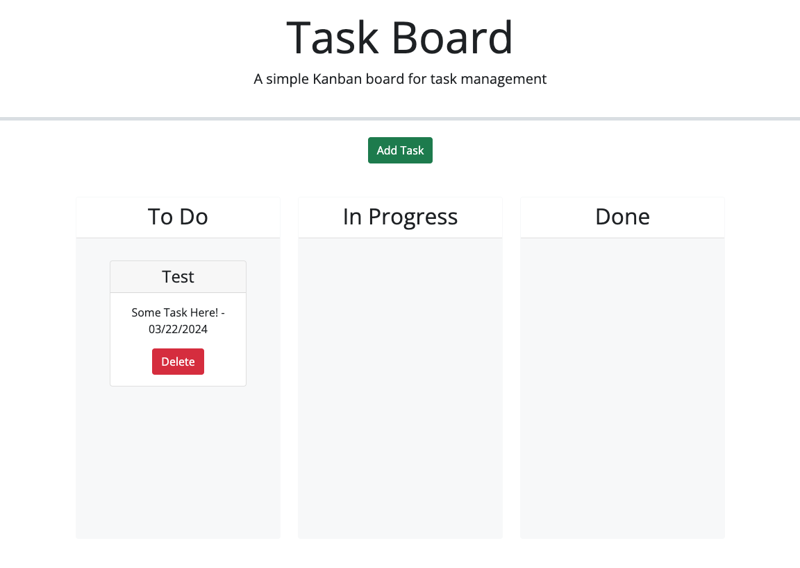

# Task Board Starter Code

## Table of Contents

- [Demo and Code](#links)
- [Description](#description)
- [Features](#features)
- [Expected Output](#expected)
- [License and Usage](#license)
- [Contact Me](#contact)


## Links
* Link to live [task manager](https://bryanpeens.github.io/task-manager/)
* Link to github [repo](https://github.com/BryanPeens/task-manager)

## Description

This project entails creating a task board application tailored for project management. The application empowers teams to efficiently organize tasks, monitor progress, and track deadlines. Leveraging starter code, a dynamic web interface was created using HTML, CSS, and jQuery, with date management facilitated by the Day.js library.

## User Story

```md
AS A project team member with multiple tasks to organize
I WANT a task board 
SO THAT I can add individual project tasks, manage their state of progress and track overall project progress accordingly
```

## Acceptance Criteria

```md
GIVEN a task board to manage a project
WHEN I open the task board
THEN the list of project tasks is displayed in columns representing the task progress state (Not Yet Started, In Progress, Completed)
WHEN I view the task board for the project
THEN each task is color coded to indicate whether it is nearing the deadline (yellow) or is overdue (red)
WHEN I click on the button to define a new task
THEN I can enter the title, description and deadline date for the new task into a modal dialog
WHEN I click the save button for that task
THEN the properties for that task are saved in localStorage
WHEN I drag a task to a different progress column
THEN the task's progress state is updated accordingly and will stay in the new column after refreshing
WHEN I click the delete button for a task
THEN the task is removed from the task board and will not be added back after refreshing
WHEN I refresh the page
THEN the saved tasks persist
```
## Expected Output

The following screenshot shows the application functionality:



## Features

### External Libraries:
- The document includes links to external libraries such as Bootstrap, Font Awesome, jQuery UI, and Day.js. These libraries are utilized to enhance the functionality and styling of the web application.

### Add Task Button:

- Provides a button labeled "Add Task" that triggers a modal dialog when clicked. This button allows users to add new tasks to the task board.

### Modal Dialog for Adding Tasks:

- Displays a modal dialog when the "Add Task" button is clicked.
- Users can input task details such as title, description, and due date via form inputs within the modal dialog.

### Task Lanes:

- Divided into three columns representing different task statuses: "To Do," "In Progress," and "Done."
- Each column contains a card container where task cards are dynamically rendered based on their status.

### Task Cards:

- Dynamically generated task cards represent individual tasks.
- Each task card displays the task title, description, and due date.
- Task cards are draggable, allowing users to move tasks between different status lanes.

### JavaScript Functionality:

- Manages the task list and its state using JavaScript.
- Handles adding, deleting, and updating tasks.
- Utilizes localStorage to persist task data.
- Implements drag-and-drop functionality for moving tasks between lanes.
- Initializes datepicker for selecting due dates.

### Custom Styling:

- Applies custom styling to the task cards, making them visually appealing and interactive.
- Defines a minimum height for the task lanes to ensure proper display on different screen sizes.

### Browser Output:
- In the web browser, the user is prompted to create a task.
- The task should then be added to the list.

## License
[](https://opensource.org/licenses/MIT)

## Contact
- Click here to [Contact Me](mailto:peensbryan75@gmail.com)